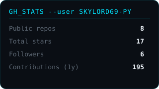
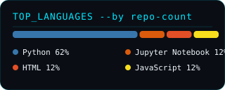

  

  

 

 

### 📊 System Diagnostics

&nbsp;&nbsp;

 

### 🧬 Contribution Graph, Reimagined

Every green cell below was a real commit at some point this year. What happens to it next isn't — it's Conway's Game of Life, seeded from the calendar above and left to run.

 

### 🎧 Currently Vibing

 

### 🚀 Currently Building

<!--REPO-LIST:START-->
| Repository | What it is | Stack | |
|:--|:--|:--|:--:|
| **[Guitar-Tone-FX-Pedal-Classifier](https://github.com/SKYLORD69-PY/Guitar-Tone-FX-Pedal-Classifier)** | An audio signal processing and classical ML pipeline built with Libro... |  | ⭐ 1 |
| **[Campus-Quick-Snack-Case-Study](https://github.com/SKYLORD69-PY/Campus-Quick-Snack-Case-Study)** | This Repository includes my research on students studying in Vijaybho... |  |  |
| **[Global_Path_AI](https://github.com/SKYLORD69-PY/Global_Path_AI)** | Work in progress — no description yet. |  | ⭐ 1 |
| **[nifty100-financial-intelligence-platform](https://github.com/SKYLORD69-PY/nifty100-financial-intelligence-platform)** | Production-grade analytics for all 92 Nifty 100 companies. ETL pipeli... |  | ⭐ 1 |
| **[bluestock-mf-capstone](https://github.com/SKYLORD69-PY/bluestock-mf-capstone)** | Mutual Fund Analytics Platform capstone for Bluestock Fintech: ETL, N... |  | ⭐ 1 |
<!--REPO-LIST:END-->

 

### 🧭 Side Quests

- 🤖 **Autonomous Robotics** — ROS2, Arduino, sensor fusion. Robots that *mostly* go where they're told.
- 🎸 **Math-Metal & Acoustic Guitar** — odd time signatures on stage, clean fingerstyle off it.

 

### 📰 Recent Activity

<!--ACTIVITY:START-->
**Recent activity**
- 📦 pushed 0 commits to [`SKYLORD69-PY/SKYLORD69-PY`](https://github.com/SKYLORD69-PY/SKYLORD69-PY)
- 📦 pushed 0 commits to [`SKYLORD69-PY/Guitar-Tone-FX-Pedal-Classifier`](https://github.com/SKYLORD69-PY/Guitar-Tone-FX-Pedal-Classifier)
- 🔀 merged a pull request on [`SKYLORD69-PY/Guitar-Tone-FX-Pedal-Classifier`](https://github.com/SKYLORD69-PY/Guitar-Tone-FX-Pedal-Classifier)
- 🔀 opened a pull request on [`SKYLORD69-PY/Guitar-Tone-FX-Pedal-Classifier`](https://github.com/SKYLORD69-PY/Guitar-Tone-FX-Pedal-Classifier)
- 📦 pushed 0 commits to [`SKYLORD69-PY/Campus-Quick-Snack-Case-Study`](https://github.com/SKYLORD69-PY/Campus-Quick-Snack-Case-Study)
<!--ACTIVITY:END-->

 

### 📖 Guestbook

Passing through? Leave a note — it lands in [`GUESTBOOK.md`](GUESTBOOK.md) automatically.

  

 

🎓 Education

 
AI/ML Engineering, Vijaybhoomi University — Class of 2028.

