<div align="center">


<a href="https://git.io/typing-svg">
  
</a>

<i>Turning caffeine into code, and code into things that (mostly) work.</i>

<br>


</div>

<br>

<div align="center">


</div>

---

## 💻 `cat /etc/developer_info.json`

```json
{
  "handle": "SKYLORD69-PY",
  "role": ["AI/ML Engineer", "Full-Stack Developer"],
  "status": "compiling_the_future()",
  "focus": [
    "Designing & training machine learning models",
    "Building production-grade data analytics pipelines",
    "Shipping scalable full-stack web applications",
    "Local-first AI tooling & on-device inference"
  ],
  "currently_online": true,
  "shell": "skylord@kernel:~$",
  "philosophy": "ship_fast() -> break_things() -> learn_faster() -> repeat();",
  "coffee_dependency": "critical"
}
```

---

## 🧠 `TECH_STACK.hud`

### `> AI_ML_ENGINE`

<p align="center">
  
</p>
<p align="center">
  
  
  
</p>

### `> FULL_STACK_CORE`

<p align="center">
  
</p>

### `> DEVOPS_AND_TOOLING`

<p align="center">
  
</p>

---

## 📀 `ls -la ~/projects --sort=recent`

<!-- REPOS_START -->
| Repository | 🕒 Last Commit | 🛠️ Language | Description |
|:------------|:--------------:|:------------|:------------|
| 🔄 _Syncing..._ | — | — | _Live repository data populates here after the first GitHub Actions run — trigger it manually from the **Actions** tab, or wait for the next scheduled sync._ |
<!-- REPOS_END -->

---

## 📡 `tail -f ~/.github/events.log`

<!--START_SECTION:activity-->
<!--END_SECTION:activity-->

---

## 🎮 SIDE QUESTS / EXPERIMENTAL MODULES

<details>
<summary><b>▶ Click to expand hidden game modes</b></summary>
<br>

### 🤖 Side Quest 01 — Autonomous Robotics
`ROS2` · `Arduino` · `Sensor Fusion`

<p align="left">
  
</p>

Weekend builds in navigation and perception — wiring up sensor-fusion pipelines, tuning ROS2 nodes, and getting Arduino-driven hardware to make sane decisions in a messy, analog world. The through-line from published navigation research is real: a robot that doesn't know where it is can't do anything useful.

### 🎸 Side Quest 02 — Acoustic & Math-Metal Guitar
`Pattern Recognition` · `Complex Rhythms` · `Noise-to-Signal Tuning`

Odd time signatures scratch the same itch as debugging a stubborn model — it's all pattern recognition. Math-metal on the fretboard: polyrhythms in the right hand, the left hand hunting for the next unresolved chord shape.

</details>

---

## 📊 `ANALYTICS.hud --live`

<div align="center">






### `> contribution_snake.render()`


</div>

---

<details>
<summary>📁 <b>System Specifications / Log</b></summary>
<br>

```yaml
education:
  institution: Vijaybhoomi University
  program: AI/ML Engineering
  class_of: 2028
system:
  kernel_version: human-v1.0
  uptime: "since day one"
  last_reboot: never
```

</details>

<div align="center">

[](https://www.linkedin.com/in/pranav-bagul-98ba01267)
[](mailto:pranavbagul154@gmail.com)
[](https://github.com/SKYLORD69-PY)

[](https://www.youtube.com/watch?v=Y7JG63IuaE4)

</div>


