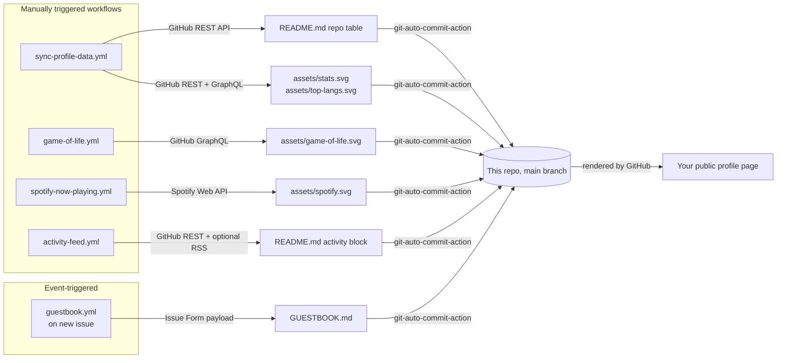

# Setup Guide

This repo is your GitHub profile page: everything in `README.md` renders
on `github.com/SKYLORD69-PY`. This guide gets every moving part running.

## How it fits together



Every workflow is independent: one failing doesn't take another down
(each is its own job, and `sync-profile-data.yml` isolates its two
steps with `continue-on-error`). Nothing here needs a server you have
to keep running — GitHub's own infrastructure is the only thing that
has to stay up.

---

## Step 0 — one repo setting almost everyone misses

**Settings → Actions → General → Workflow permissions → select
"Read and write permissions" → Save.**

By default new repos give Actions **read-only** access to `GITHUB_TOKEN`.
Every workflow here needs to *push a commit back*, so without this
change, all five will fail at the commit step on their very first run
— quietly, unless you go looking. Do this before anything else.

---

## Secrets & variables reference

| Name | Type | Required for | Where it comes from |
|---|---|---|---|
| `GH_PAT` | Secret | Game of Life, follower/contribution counts in stats | Step 1 below |
| `SPOTIFY_CLIENT_ID` | Secret | Spotify card | Step 2 below |
| `SPOTIFY_CLIENT_SECRET` | Secret | Spotify card | Step 2 below |
| `SPOTIFY_REFRESH_TOKEN` | Secret | Spotify card | Step 2 below |
| `BLOG_RSS_URL` | **Variable** (not secret) | Optional blog section in Recent Activity | Your own blog's RSS/Atom feed URL |
| `GITHUB_TOKEN` | Auto-provided | Everything else | Nothing to do — every Actions run gets one free |

Secrets go in **Settings → Secrets and variables → Actions → Secrets**.
`BLOG_RSS_URL` goes in the **Variables** tab of that same page (it's
not sensitive, so it doesn't need to be a secret).

---

## Step 1 — GH_PAT (powers the Game of Life)

The contribution calendar is only exposed over GitHub's **GraphQL**
API, and GraphQL always requires a token with `read:user` — the
automatic `GITHUB_TOKEN` isn't scoped for it.

1. GitHub → Settings (your account, not the repo) → Developer settings
   → **Personal access tokens → Tokens (classic)** → Generate new token.
2. Name it something like `profile-readme-gol`, set an expiration
   (90 days is a reasonable default — see the reminder note below),
   and check **only** the `read:user` scope. Nothing else is needed.
3. Copy the token immediately (GitHub only shows it once) and add it
   as a repo secret named `GH_PAT`.

> Classic PATs expire. When yours does, `game-of-life.yml` will fail
> loudly (by design — see "error handling philosophy" below) rather
> than silently freezing the animation. Set a calendar reminder for
> a few days before expiry, generate a new one, and swap the secret.

## Step 2 — Spotify Now Playing

**Requirement:** as of Spotify's early-2026 API changes, apps in
Development Mode only work if the app owner has an active **Spotify
Premium** subscription — you're already covered there. Worth
double-checking Spotify's current [Web API terms](https://developer.spotify.com/policy)
when you set this up, since their developer policies have shifted a
few times recently.

1. Go to the [Spotify Developer Dashboard](https://developer.spotify.com/dashboard)
   → **Create app**.
   - App name / description: anything.
   - Redirect URI: `http://127.0.0.1:8888/callback` — must match exactly.
   - Which API/SDKs: check **Web API**.
2. Open the new app → **Settings** → copy the **Client ID** and
   **Client Secret**.
3. On your own machine (not in Actions):
   ```bash
   export SPOTIFY_CLIENT_ID="paste-it-here"
   export SPOTIFY_CLIENT_SECRET="paste-it-here"
   python scripts/spotify_auth_helper.py
   ```
   This opens your browser, you click "Agree," and the script prints
   a `refresh_token`.
4. Add all three as repo secrets: `SPOTIFY_CLIENT_ID`,
   `SPOTIFY_CLIENT_SECRET`, `SPOTIFY_REFRESH_TOKEN`.

The refresh token doesn't expire from time passing — only from being
revoked (e.g., you remove the app's access in your Spotify account
settings), so this is normally a one-time step.

## Step 3 — (optional) your blog

Have a blog with an RSS/Atom feed? Add its URL as a repo **variable**
(not secret) named `BLOG_RSS_URL`. Don't have one? Leave it unset —
`activity_feed.py` checks for it and just skips that section cleanly.

## Step 4 — turn everything on and verify

Actions are enabled by default. These profile-update workflows are
manual-only so the repository does not accumulate multiple automated
commits every day. For each workflow you want to run: **Actions tab →
select the workflow → "Run workflow"** (the `workflow_dispatch`
trigger every workflow here has). Watch it go green. If it goes red, click
in — the scripts are
written to fail with a specific `::error::` message rather than a
bare stack trace, so the log will tell you exactly which secret is
missing or wrong.

Suggested order: `sync-profile-data.yml` first (fewest dependencies),
then `game-of-life.yml`, then `spotify-now-playing.yml`, then
`activity-feed.yml`. Try `guestbook.yml` by actually opening a test
guestbook entry via the issue template once the others are green.

---

## Design notes (the "why" behind a few choices)

**Why generate our own stats cards instead of embedding
github-readme-stats.vercel.app directly?** The public instance is
shared by an enormous number of profiles and is well documented (by
its own maintainers) to hit rate limits and return 503s intermittently.
Generating `assets/stats.svg` ourselves means the only dependency is
GitHub's own API — same trust boundary as everything else here.

**Why does the Game of Life grid wrap top-to-bottom and side-to-side?**
The real calendar is only 7 rows tall. On a flat grid, most patterns
hit that wall and die out almost immediately. Treating it as a torus
(both edges wrap) keeps the simulation visually alive for the whole
animation instead of fizzling into a static frame after a few
generations.

**Why are the profile workflows manual-only?** Each workflow writes a
different part of the profile, and independent schedules can create many
small commits in one day. Keeping their `workflow_dispatch` triggers
means you can still refresh any section when you choose, while normal
repository activity stays to deliberate updates. The guestbook remains
event-driven because a new signed entry is an explicit user action.

**Why does the auto-commit not trigger the *other* workflows?**
Commits made using the default `GITHUB_TOKEN` deliberately don't
trigger other `push`-based workflows (GitHub's own loop-prevention).
It's a non-issue here since profile workflows are `workflow_dispatch`
triggered and the guestbook is event-driven; none are `push`-chained.

**Error-handling philosophy.** Every script treats "nothing to show
yet" (empty account, nothing playing) as a quiet success, and treats
"something is actually broken" (bad token, dead API) as a loud
`exit 1`. GitHub only emails you when a scheduled workflow's status
*changes* from passing to failing, so a real break gets your
attention exactly once, without spamming you for things that were
never wrong to begin with.

---

## Troubleshooting

| Symptom | Likely cause |
|---|---|
| Every workflow fails at "Commit changes" | Step 0 — workflow permissions are still read-only |
| `game-of-life.yml` fails with a 401/403 | `GH_PAT` missing, expired, or missing `read:user` |
| Spotify card frozen on one song for days | `SPOTIFY_REFRESH_TOKEN` was revoked — redo Step 2 |
| Spotify card never shows "Now Playing" | You need to actually be playing something within the ~10 min before a run; otherwise it correctly falls back to "Last Played" |
| Guestbook issue doesn't get processed | The label on the issue isn't exactly `guestbook` — check the issue template wasn't renamed |
| Repo table/activity section still says "syncing..." | The workflow hasn't run yet — trigger it manually per Step 4 |
